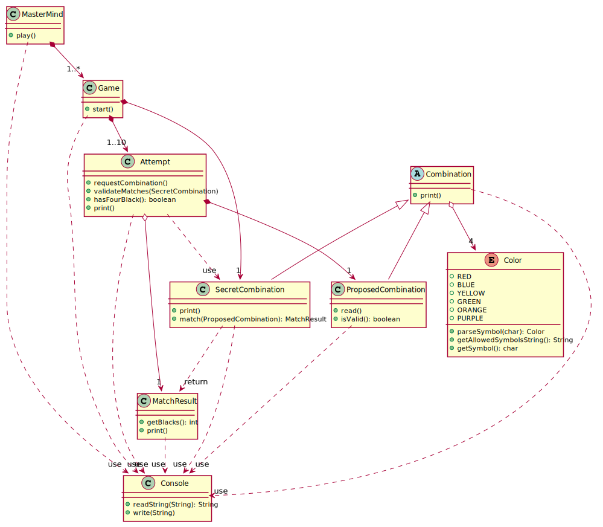

# Juego Mastermind
Este proyecto contiene gran parte de las prácticas llevadas a cabo durante el
[Máster de Desarrollo de Software](https://escuela.it/master-desarrollo-software)
tomado en [Escuela IT](https://escuela.it).

## Diseño de la solución
Esta es la primera aproximación en la cual la definición de clases, y la asignación
de sus correspondientes responsabilidades, se ha inspirado única y exclusivamente en
el [modelo del dominio](docs/escuelait/Mastermind.pdf) y [requisitos](docs/escuelait/index.html)
dados.

