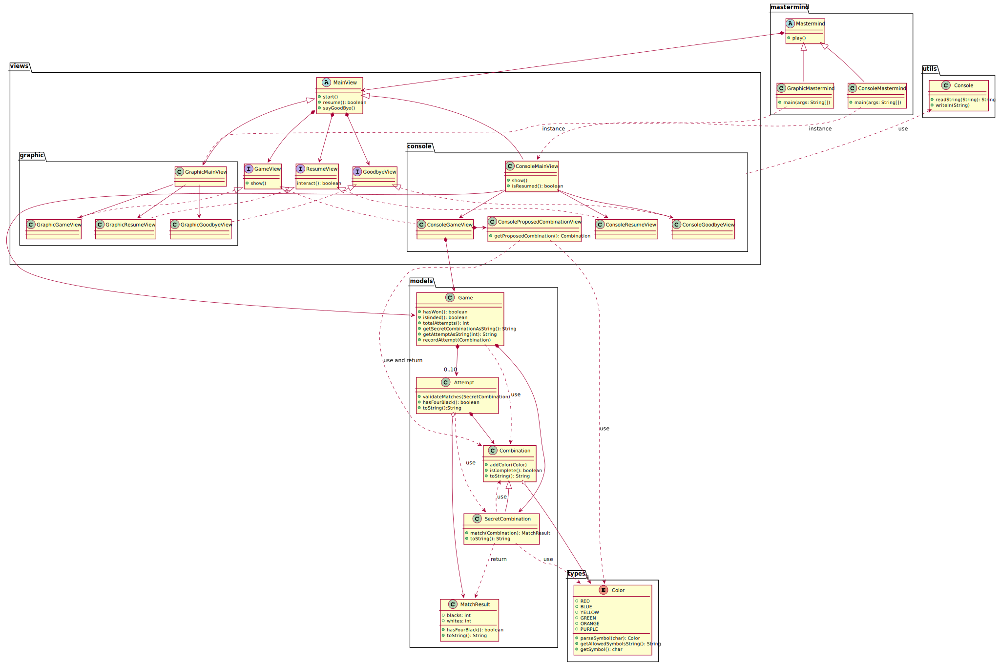

# Juego Mastermind
Este proyecto contiene gran parte de las prácticas llevadas a cabo durante el
[Máster de Desarrollo de Software](https://escuela.it/master-desarrollo-software)
tomado en [Escuela IT](https://escuela.it).

## Diseño de la solución
Este es el segundo enfoque de la solución, con el cual se ha refinado el diseño
separando la funcionalidad inherente a la presentación y captura de datos en clases
de vistas.

El [modelo del dominio](docs/escuelait/Mastermind.pdf) y los [requisitos](docs/escuelait/index.html)
son los mismos que en la versión anterior.

